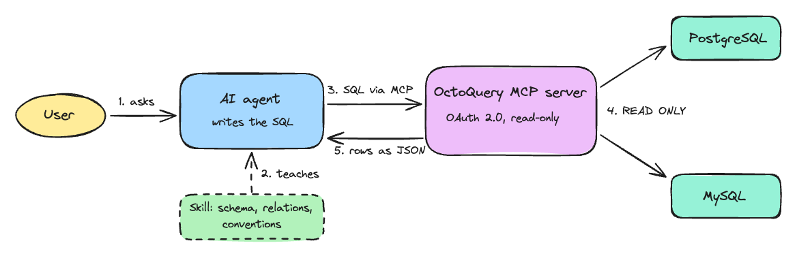

# OctoQuery

**Turn your databases into AI-ready tools.** OctoQuery is a thin MCP (Model Context Protocol) server around your databases: every database you configure becomes one MCP tool that an AI agent — Claude, your IDE assistant, or any other MCP client — can call with plain SQL. See [Supported databases](#supported-databases) for what it can connect to today.

## Motivation

AI agents are great at writing SQL, but they need two things to be useful with *your* data:

1. **Access** — a safe, standard way to run queries. OctoQuery provides that: each configured database is exposed as a single MCP tool (e.g. `sql_orders_prod`, `sql_analytics_dev`) that accepts a `query` string and returns rows as JSON. Adding a database is one JSON entry — no code.
2. **Understanding** — knowledge of your schema, relations, and conventions. For that, you pair each database tool with an **agent skill**: a markdown file describing the tables, how they join, and what the gotchas are (money in cents, soft deletes, statuses to exclude, ...). With a skill, the agent reasons about your database efficiently instead of guessing at the schema query by query.



This repo ships working examples of both: four demo databases ([demo/](demo/docker-compose.yml) — one per supported engine) with their matching skills ([ecommerce-demo-db](.agents/skills/ecommerce-demo-db/SKILL.md), [blog-demo-db](.agents/skills/blog-demo-db/SKILL.md), [library-demo-db](.agents/skills/library-demo-db/SKILL.md), [helpdesk-demo-db](.agents/skills/helpdesk-demo-db/SKILL.md)), wired together through [AGENTS.md](AGENTS.md). Use them as the template for your own databases.

Under the hood it's a NestJS service speaking MCP over Streamable HTTP at `/mcp`, protected by OAuth 2.0 (optional for local use). Connections are opened lazily on first query, so databases don't need to be reachable at startup.

## Supported databases

| Database              | Status       |
| --------------------- | ------------ |
| PostgreSQL            | ✅ Supported |
| MySQL                 | ✅ Supported |
| MariaDB               | ✅ Supported |
| SQL Server (MSSQL)    | ✅ Supported |

More engines may be added over time — contributions are welcome.

## Quick start

From clone to asking your data questions in three steps: **run the server** (backed by seeded demo databases), **connect your AI agent**, and **try the demo prompts**.

### Step 1 — Run the server with the demo databases

Four seeded demo databases run in Docker — one per supported engine: an e-commerce PostgreSQL (users, products, orders, order items), a blog MySQL (authors, posts, comments), a library MariaDB (books, members, loans), and a helpdesk SQL Server (customers, agents, tickets).

1. Clone the repository:

```bash
git clone https://github.com/benedya/octoquery.git && cd octoquery
```

2. Install dependencies:

```bash
npm install
```

3. Start the demo databases (PostgreSQL on `127.0.0.1:45432`, MySQL on `127.0.0.1:43306`, MariaDB on `127.0.0.1:43307`, SQL Server on `127.0.0.1:41433`, all seeded automatically):

```bash
docker compose -f demo/docker-compose.yml up -d
```

4. Configure the service — set `MCP_AUTH_ENABLED=false` in `.env` for a tokenless start; `mcp-sql-tools.json` already points at all demo databases:

```bash
cp .env.example .env && cp mcp-sql-tools.example.json mcp-sql-tools.json
```

5. Run it:

```bash
npm run start:dev
```

The MCP endpoint is now live at `http://localhost:3000/mcp` with four tools: `sql_ecommerce_demo`, `sql_blog_demo`, `sql_library_demo`, and `sql_helpdesk_demo`.


### Step 2 — Connect your AI agent

The server speaks standard MCP over Streamable HTTP, so any MCP client works — Claude Code, Claude Desktop, VS Code, JetBrains IDEs, or anything else that understands MCP. With auth disabled (local dev) no token is needed; otherwise clients go through the OAuth flow described below.

**Register the MCP server** in your agent's MCP configuration (the exact file or settings screen depends on the client, but the shape is always the same):

```json
{
  "mcpServers": {
    "octoquery": {
      "type": "http",
      "url": "http://localhost:3000/mcp"
    }
  }
}
```

**Give the agent the skills.** Point your agent at the skills in `.agents/skills/` — most agents pick them up through the project's [AGENTS.md](AGENTS.md), others discover a skills directory on their own. The skill is what turns a generic SQL tool into an agent that knows *your* schema.

### Step 3 — Try the demo

Everything here works out of the box with this repository's stock configuration: the three seeded databases from step 1 and the tool entries shipped in [mcp-sql-tools.example.json](mcp-sql-tools.example.json). Try these prompts — the agent picks the right tool and skill on its own:

| Example prompt                                       | Tool (database)                   | Skill                                                            |
| ---------------------------------------------------- | --------------------------------- | ---------------------------------------------------------------- |
| *"Who are our top 5 customers by total spend?"*      | `sql_ecommerce_demo` (PostgreSQL) | [ecommerce-demo-db](.agents/skills/ecommerce-demo-db/SKILL.md)   |
| *"Which blog post got the most comments?"*           | `sql_blog_demo` (MySQL)           | [blog-demo-db](.agents/skills/blog-demo-db/SKILL.md)             |
| *"Who has overdue library books, and which titles?"* | `sql_library_demo` (MariaDB)      | [library-demo-db](.agents/skills/library-demo-db/SKILL.md)       |
| *"Which urgent tickets are still unassigned?"*       | `sql_helpdesk_demo` (SQL Server)  | [helpdesk-demo-db](.agents/skills/helpdesk-demo-db/SKILL.md)     |

## Adding your own databases

Databases are defined entirely in `mcp-sql-tools.json` (gitignored — it holds credentials; [mcp-sql-tools.example.json](mcp-sql-tools.example.json) is the committed template):

```json
[
  {
    "name": "sql_orders_prod",
    "label": "prod orders",
    "host": "prod-db.example.com",
    "port": 5432,
    "database": "orders_service",
    "user": "orders_reader",
    "password": "...",
    "enableTLS": true
  }
]
```

Each entry becomes one MCP tool and accepts the following fields:

| Field         | Required | Default                                    | Description                                                              |
| ------------- | -------- | ------------------------------------------ | ------------------------------------------------------------------------ |
| `name`        | yes      | —                                          | Tool name shown to the agent (letters, digits, `_`, `-`; max 64 chars)   |
| `host`        | yes      | —                                          | Database host                                                            |
| `database`    | yes      | —                                          | Database name                                                            |
| `user`        | yes      | —                                          | Database user (prefer a read-only one)                                   |
| `password`    | yes      | —                                          | Database password                                                        |
| `type`        | no       | `postgres`                                 | Engine: `postgres`, `mysql`, `mariadb`, or `mssql`                       |
| `port`        | no       | engine standard (5432 postgres, 3306 mysql/mariadb, 1433 mssql) | Database port                                       |
| `label`       | no       | the `name` value                           | Human-friendly name used in the tool title and description               |
| `description` | no       | generated from `label`                     | Full override of the tool description shown to the agent                 |
| `enableTLS`   | no       | `true`                                     | Connect over TLS                                                         |
| `maxRows`     | no       | `MCP_MAX_ROWS` (100)                       | Row limit per query result for this tool                                 |

Tool names are free-form, so any environment/database combination works (`sql_orders_prod`, `sql_analytics_dev`, ...) — one entry per tool. The file is validated at startup: duplicate names, malformed JSON, or a missing file stop the service with a clear error. Set `MCP_SQL_TOOLS_FILE` to load the file from a different path (e.g. a mounted secret in Kubernetes).

To give agents real understanding of a database, add a skill next to the demo one: create `.agents/skills/<your-db>/SKILL.md` describing the schema, relations, and conventions (use [ecommerce-demo-db](.agents/skills/ecommerce-demo-db/SKILL.md) as the pattern), and list it in [AGENTS.md](AGENTS.md).

## Authentication

The service is an **OAuth 2.0 resource server** per the [MCP authorization spec](https://modelcontextprotocol.io/specification/2025-06-18/basic/authorization). It works with any OIDC provider (Auth0, Okta, ...) — configured via `AUTH_ISSUER` and `AUTH_AUDIENCE`:

1. Unauthenticated requests to `/mcp` get `401` with a `WWW-Authenticate: Bearer resource_metadata="..."` header.
2. The client fetches the RFC 9728 metadata (`GET /.well-known/oauth-protected-resource`), which points at the provider (`authorization_servers: [AUTH_ISSUER]`).
3. The client obtains an access token from the provider (authorization code + PKCE for interactive clients, client credentials for machine-to-machine).
4. The service validates the JWT against the provider's JWKS: signature (RS256), `iss`, `exp`, and — if `AUTH_AUDIENCE` is set — `aud`.

For local development set `MCP_AUTH_ENABLED=false` — all auth env vars become optional.

## Tests

Integration tests run with Jest and [Testcontainers](https://node.testcontainers.org/) — each suite starts a disposable PostgreSQL or MySQL container, so Docker must be running:

```bash
npm test
```

There is one full-stack suite per supported database (`npm run test:postgres`, `npm run test:mysql`): each boots the application against a real database container and drives the MCP endpoint over Streamable HTTP like a real client — covering tool discovery, query execution, read-only enforcement, multi-statement rejection, and row truncation.

## Testing with MCP Inspector

The [MCP Inspector](https://github.com/modelcontextprotocol/inspector) is a web UI for exercising an MCP server by hand — the quickest way to verify your setup before involving an agent:

```bash
npx @modelcontextprotocol/inspector
```

In the Inspector: select transport **Streamable HTTP**, set the URL to `http://localhost:3000/mcp`, and connect (with auth enabled, paste a bearer token in the Authentication field; with `MCP_AUTH_ENABLED=false` just connect). Under **Tools** you'll see one tool per configured database — run `sql_ecommerce_demo` with a query like `SELECT count(*) FROM orders` and inspect the JSON rows that an agent would receive. Results are truncated to the tool's `maxRows`.

## Operational notes

- **Sessions are in-memory** (map of `mcp-session-id` → transport). When running more than one replica, use sticky sessions at the ingress.
- **`BASE_URL`** must be the public URL clients see (behind a proxy this differs from `localhost:<port>`); it is used in the resource metadata and `WWW-Authenticate` challenges.
- **Read-only by default.** With `MCP_READ_ONLY=true` (the default) every query runs as a single statement inside a `READ ONLY` transaction, so the database itself rejects writes and DDL. On MySQL and MariaDB — where DDL escapes read-only transactions via implicit commit — statements are additionally restricted to a read allowlist (`SELECT`, `WITH`, `SHOW`, `DESCRIBE`, `EXPLAIN`). SQL Server has no read-only transaction mode, so there statements are restricted to `SELECT`/`WITH` without data-modifying keywords and run inside a transaction that is always rolled back. Set `MCP_READ_ONLY=false` to allow data modification.
- With read-only mode disabled the SQL tools execute arbitrary SQL — the caller is fully trusted. Access control is entirely provider-side, so a token grant should be treated as a database access grant. Read-only database users are still the strongest guarantee.

## License

[MIT](LICENSE)
